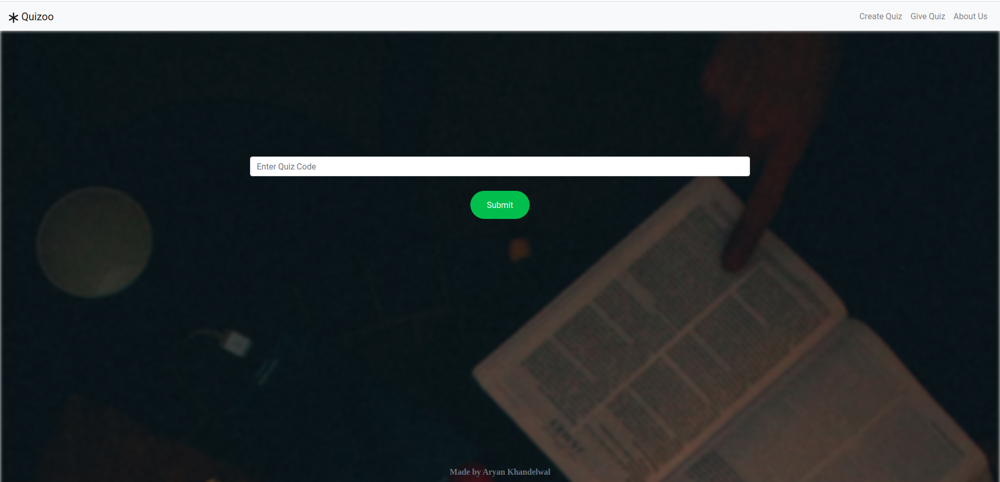
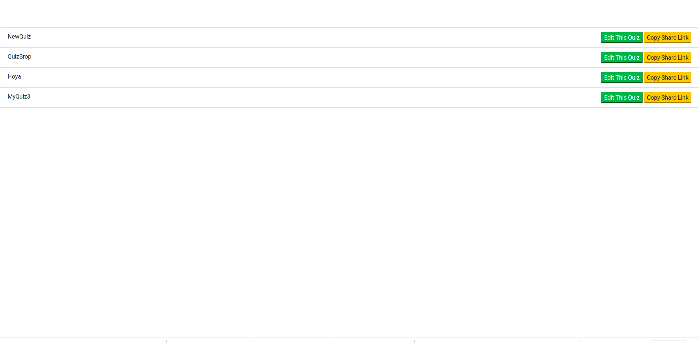
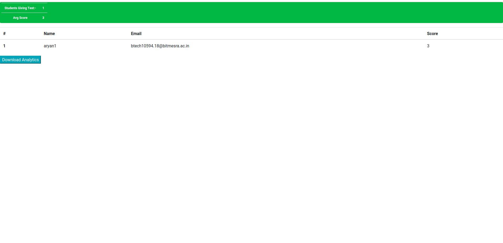

# Quizoo :green_book::closed_book:
Free Online Quiz Platform for conducting quizes with lots of security features to avoid cheating and completely free   

</img>    
      

### Detailed List of Features it should have 
* Allow Creation of Quiz
* Allow People to give quiz by simple google sign in
* Proper Statistical Analysis of the Quiz to the admin after that Quiz
* Allow Admin to Re-schedule timing of quiz
* Allow addition and deletion of questions on admin panel
* Users to get questions in random order only one question visible at a time
* Show timer to user in which quiz is about to over
* Immediate test end in case of tab change or exiting full window
* List of Settings on Admin side
  * Auto email students there score after test got over
  * Show questions in random order or not
  * Shuffle options or not
  * Show students their score during the test itself
  * Can a student reattempt test after its end time
  * Allow admin to retake a previous quiz
  * Allowing multiple admins for a quiz
  * Camera On mode or not
  * Generating a Random Quiz from Previously owned question set 
  * Give x amount of questions to each user from a pool of n questions

 * A nice good looking and user friendly frontend is must
 * Allow addition of images and formatted text in questions and options
 
### :camera: Screenshots
Enter Quiz Code to Start Quiz    
<kbd>

</kbd>
         
Edit Quiz In your pannel  
<kbd>

</kbd>
         
Detailed Analysis after test is over       
<kbd>
    
</kbd>
       
         
Quiz Settings Page      
<kbd>

</kbd>

### Contribution
Don't be lazy:smile: clone this repo ad start contributing
