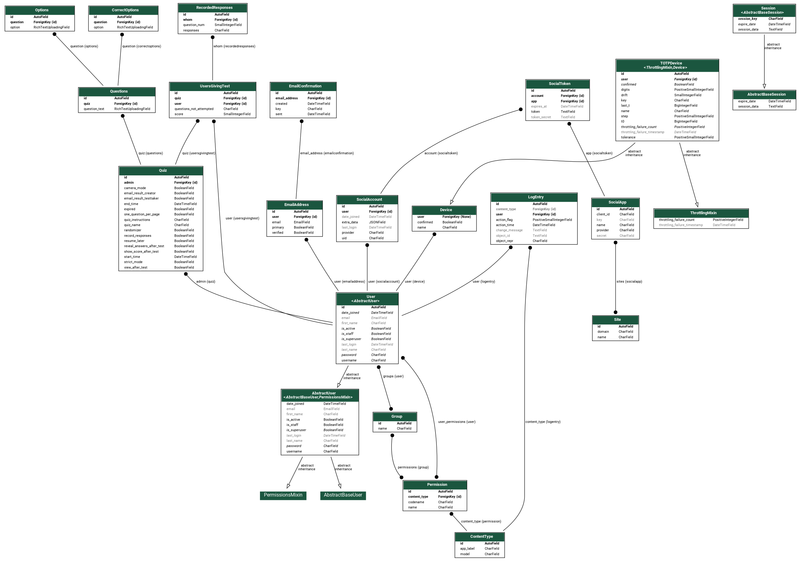
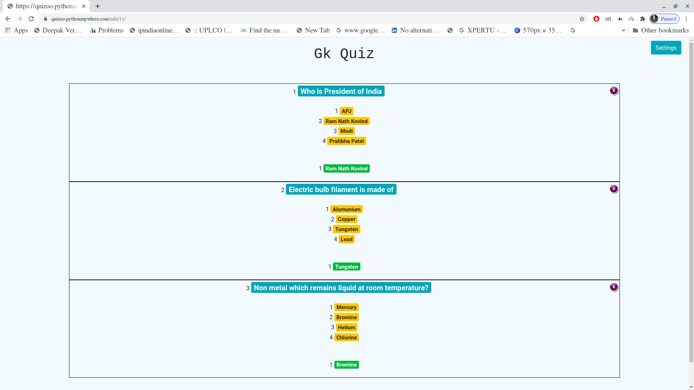
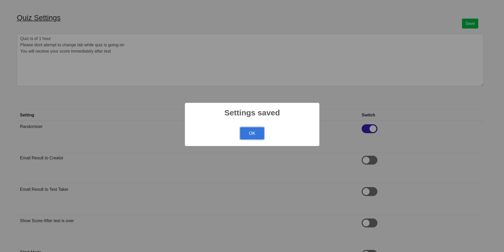
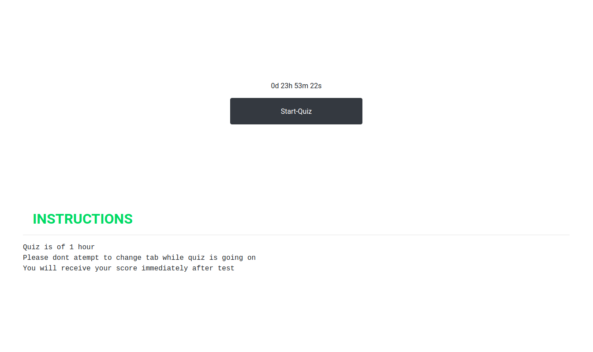
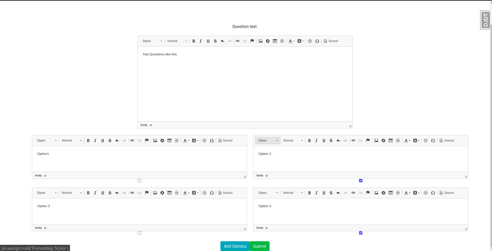
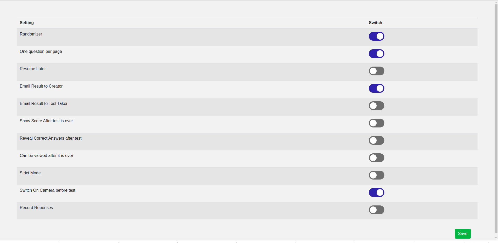

# Quizoo
 
[](https://github.com/aryan29/Quizoo/issues)   [](https://github.com/aryan29/Quizoo/network)   [](https://github.com/aryan29/Quizoo/stargazers)     
Do leave a star :star: if you like this repo :blush:   
<hr></hr>

</img>     
Free Online Quiz Platform for conducting quizes with lots of security features to avoid cheating and completely free    
    


## Why Quizoo?
With Quizoo you can conduct mcqs test online too easily within matter of minutes without worrying about anything Quizoo will handle everything for you.     
It includes various features which makes it difficult to conduct cheating online and prevent it to the maximum level possible  
### LockDown Browser
It’s a custom browser window that adds more security to the exam environment by disabling those features that can be misused. When the lockdown browser is enabled during an exam, it restricts candidates from opening console, accessing other websites, switching applications, copying or printing questions, or even taking screenshots.     
### Resquencing Questions with NoBack Button
Most of the time participants tend to cheat because they can view all questions at once or move back to the previous questions , it becomes very difficult for the participants to cheat in limitted time if every person will get questions in different order and they are not allowed to move back to the previous question     
### Automated Image Poctoring(In Development)
This tool allows test creator to enable camera & microphone mode which sends audio-video and screen share feeds and makes use of advanced audio and video analytics to monitor any suspicious activities during the test      
Currenly this tool only detect if particpant is looking towards screen or not and if there aren't multiple people present on screen, and much more to come     
### Personalized Test Reports
Quizoo automatically creates personalized test reports for each of the students attending the test which includes various details including the time taken by student on a particular question , moment of time when student is expected doing some unexpected behaviour including the screenshot at that moment of time and a lot more    

Beside all that Quizoo makes it easy to send results to each candidate's email address or downloading excel sheet of cadidate's responses  by just enabling few setting from the quiz panel  

## Architecture and Database
The app is hosted using uWSGI Server and make use of NGINX for hosting static files and as a reverse proxy      
        
Here is how the database design looks like for the Django App

</img>    
Database used is sqlite3 at current moment but will shift to postgresql in future  if database grew 

It makes use of Redis for storing session on backend

##  Futures Coming
* Automated Image Poctoring 
* Live Anouncements during online test from admin panel
* View the candidate’s screen- live
* Allow user to select questions of particular categories from the already avilable question set

## :camera_flash: ScreenShots   
| 1 | 2|
|------|-------|
|||


| 3 | 4|
|------|-------|
|||

| 5 | 6 |
|------|-------|
|||

### Get Started
##### Django Development Server
```
git clone https://github.com/aryan29/Quizoo.git    
cd Quizoo    
git checkout dev  
virtualenv venv
source venv/bin/activate
pip install -r requirements.txt
cd quizoo
python manage.py runserver
```  
##### Nginx Deployment Server
```
git clone https://github.com/aryan29/Quizoo.git    
cd Quizoo    
git checkout dev    
sudo docker-compose -f docker-compose-deploy.yml up --build  
```  

### Contribution
Don't be lazy:smile: clone this repo and start contributing     

### Video Demo [here](https://www.dailymotion.com/video/x7x63hk)

## Contributors
[Aryan Khandelwal](https://github.com/aryan29)    
[Mukul Choudhury](https://github.com/Mukul-9)    
[Vibhu Bhatia](https://github.com/vibhubhatia007)    

